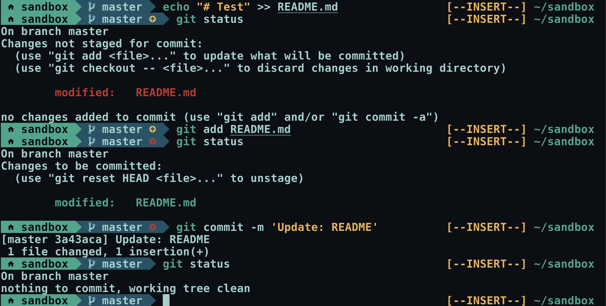

```
                          O
                          o                O
                          O               oOo
.oOo. O   o  .oOo  .oOoO' o  O   o .oOo.   o   O   o  .oOo
OooO' o   O  O     O   o  O  o   O O   o   O   o   O  `Ooo.
O     O   o  o     o   O  o  O   o o   O   o   O   o      O
`OoO' `OoO'o `OoO' `OoO'o Oo `OoOO oOoO'   `oO `OoO'o `OoO'
                                 o O
                              OoO' o'`
```


eucalyptus
---

Simple one-line zsh prompt theme for minimalist vim-mode user.

This theme is inspired by other themes introducing powerline,
such as [agnoster](https://github.com/agnoster/agnoster-zsh-theme) and
[powerlevel9k](https://github.com/bhilburn/powerlevel9k).



Features
---

- *Simple git status indicator*
    - Current branch
    - Changes not staged for commit
    - Changes to be committed
- *Vim mode indicator*
    - Insert mode
    - Normal mode
- *Current directory name* (left prompt)
- *Current directory path* (right prompt)

Requirements
---

- *zsh* (of course)
- *Nerd fonts* in your terminal (check [Nerdfonts web site](https://nerdfonts.com))
- *Vi-mode* is enabled


Installation
---

```zsh
# Clone this repository
git clone https://github.com/relastle/eucalyptus.git


# append the root directory to your fpath
fpath=(/path/to/eucalyptus $fpath)

# Add the following lines into your ~/.zshrc
autoload -U promptinit; promptinit
prompt eucalyptus
setopt prompt_subst
```

Note
---

- My terminal color scheme is based on [Gotham theme](https://github.com/whatyouhide/gotham-contrib).
